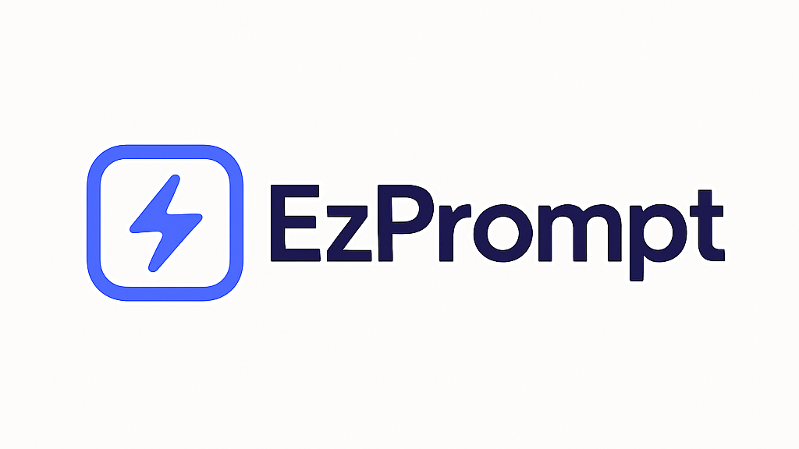

# EzPrompt

EzPrompt est une application web qui permet de créer, gérer et réutiliser facilement des modèles de prompts pour l'IA. Conçue pour simplifier vos interactions avec les modèles d'IA comme ChatGPT, Claude ou autres LLMs.



## 🚀 Fonctionnalités

- ✅ Création et gestion de modèles de prompts
- ✅ Variables personnalisables dans les prompts
- ✅ Prévisualisation des prompts avec valeurs d'exemple
- ✅ Organisation par catégories
- ✅ Favoris pour accéder rapidement à vos modèles préférés
- ✅ Interface utilisateur intuitive et responsive
- ✅ Thème clair moderne

## 📋 Prérequis

- Node.js 18.0.0 ou version ultérieure
- npm ou yarn

## 🔧 Installation

1. Clonez le dépôt :
   ```bash
   git clone https://github.com/dimitrimabom/ezprompt.git
   cd ezprompt
   ```

2. Installez les dépendances :
   ```bash
   npm install
   # ou
   yarn install
   ```

3. Lancez l'application en mode développement :
   ```bash
   npm run dev
   # ou
   yarn dev
   ```

4. Ouvrez [http://localhost:3000](http://localhost:3000) dans votre navigateur.

## 🏗️ Structure du projet

```
ezprompt/
├── app/                    # Dossier principal de l'application Next.js
│   ├── dashboard/          # Page tableau de bord
│   ├── templates/          # Pages de gestion des modèles
│   ├── globals.css         # Styles globaux
│   └── layout.tsx          # Layout principal
├── components/             # Composants réutilisables
│   ├── ui/                 # Composants d'interface utilisateur
│   ├── header.tsx          # En-tête de l'application
│   ├── template-card.tsx   # Carte de modèle
│   └── ...
├── lib/                    # Utilitaires et logique métier
│   ├── template-store.ts   # Gestion des modèles
│   └── utils.ts            # Fonctions utilitaires
├── hooks/                  # Hooks React personnalisés
├── public/                 # Fichiers statiques
└── ...
```

## 💻 Technologies utilisées

- **Next.js 15** - Framework React avec App Router
- **React** - Bibliothèque UI
- **TypeScript** - Typage statique
- **Tailwind CSS** - Framework CSS utilitaire
- **shadcn/ui** - Composants d'interface utilisateur
- **Sonner** - Notifications toast modernes
- **Lucide React** - Icônes

## 🔍 Utilisation

### Créer un nouveau modèle

1. Accédez à la page "Templates"
2. Cliquez sur "New Template"
3. Remplissez les détails du modèle (titre, description, catégorie)
4. Ajoutez des variables en utilisant la syntaxe `{{nom_variable}}`
5. Écrivez votre modèle de prompt
6. Cliquez sur "Save Template"

### Utiliser un modèle

1. Accédez à la page "Templates"
2. Trouvez le modèle que vous souhaitez utiliser
3. Cliquez sur "Use"
4. Remplissez les valeurs des variables
5. Cliquez sur "Generate Prompt"
6. Copiez le prompt généré dans votre application d'IA préférée

## 🔜 Fonctionnalités à venir

- [ ] Persistance des données avec localStorage
- [ ] Export/import de modèles
- [ ] Raccourcis clavier
- [ ] Gestion des catégories personnalisées
- [ ] Partage de modèles
- [ ] Versionnement des modèles

## 🤝 Contribution

Les contributions sont les bienvenues ! N'hésitez pas à ouvrir une issue ou à soumettre une pull request.

1. Forkez le projet
2. Créez votre branche de fonctionnalité (`git checkout -b feature/amazing-feature`)
3. Committez vos changements (`git commit -m 'Add some amazing feature'`)
4. Poussez vers la branche (`git push origin feature/amazing-feature`)
5. Ouvrez une Pull Request

## 📄 Licence

Ce projet est sous licence MIT. Voir le fichier `LICENSE` pour plus d'informations.

## 📬 Contact

Votre Nom - [@dimitrimabom](https://twitter.com/dimitrimabom) - www.altplus.dev

Lien du projet: [https://github.com/dimitrimabom/ezprompt](https://github.com/dimitrimabom/ezprompt)
